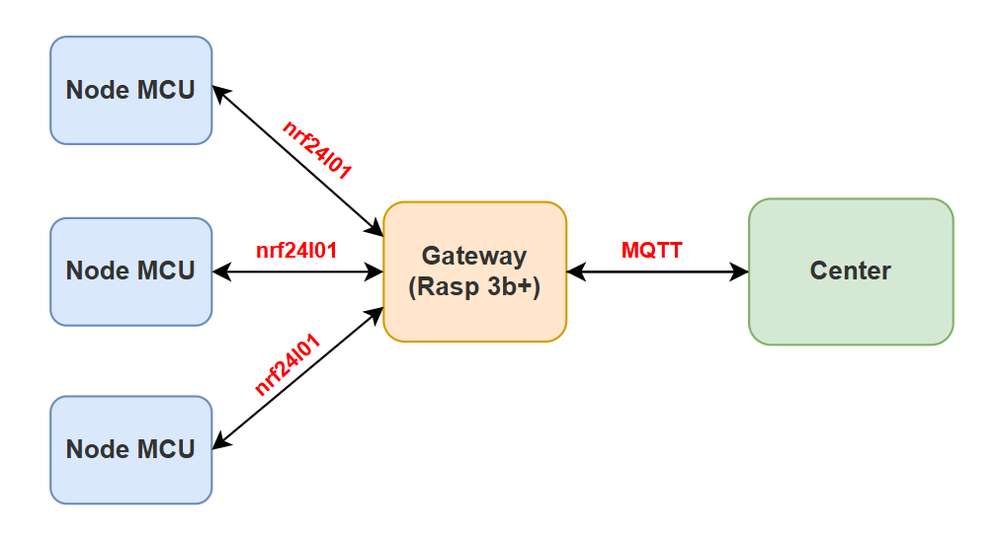
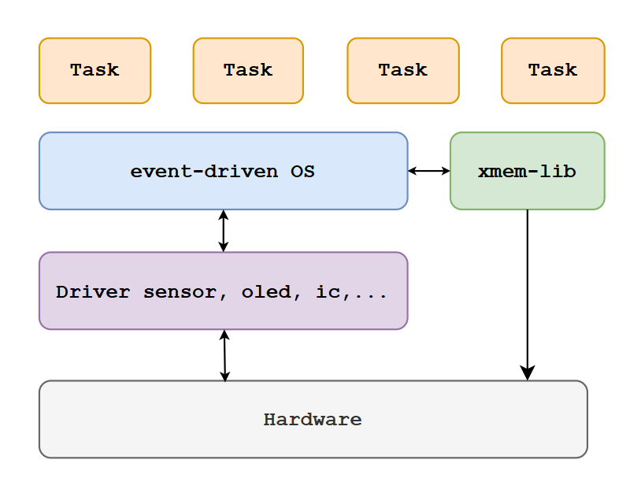
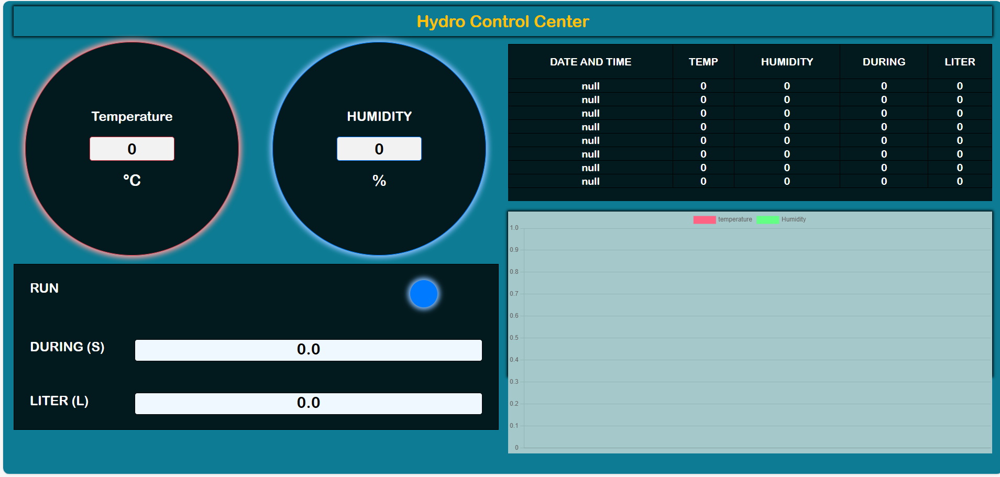

# 🌱 Multi-Node Agricultural Monitoring via IoT Gateway

  

## I. System Overview
This project implements a **distributed embedded and IoT system** for crop monitoring and automated watering.
- Multiple **AVR-based sensor nodes** collect environmental data (temperature, humidity, light, soil moisture).
- A **Raspberry Pi 3B+** acts as an **IoT gateway**, aggregating data from sensor nodes via **NRF24L01** wireless modules and forwarding it through **MQTT** to a host.
- A **host machine** visualizes the data via a web dashboard in real-time.

  

## II. System Architecture
### 1. Node MCU (Sensor Node) Software Architecture
- The node runs a **lightweight event-driven OS**.
- Each **task** in the OS is implemented as a **finite state machine (FSM)**.

  

> All OS details can be found in the `os/` directory.

### 2. IoT Gateway (Raspberry Pi) Software Architecture
- A custom **device driver** is implemented for NRF24L01 communication.
- Non-essential components are removed to **increase processing speed**.
- The gateway receives data from sensor nodes, processes it, and publishes to **MQTT broker** for the host.

## III. Devices
| No.     |        Component      | Role            | 
| :-----: | :--------------------:| :--------------:| 
|    1    | Raspberrby 3B+        | IoT Gateway     | 
|    2    | ATmega2560            | Sensor Node MCU |        
|    3    | DHT22                 | Temperature & Humidity Sensor      |  
|    4    | BH1750                | Light Intensity Sensor       |  
|    5    | SSD1306               | Local Display      |   
|    6    | SRAM 62256 DIP-28     | External Memory    | 
|    5    | Soil moisture         | Soil Condition Monitoring      | 
|    6    | DC water pump motor   |       | 
|    7    | Module Relay 5V       |       |  

## 🚀 IV. Getting Started
Follow these steps to set up and run the project:

1. **Clone the Repository:**  
   Clone this repository to your local machine using:
   ~~~bash
   https://github.com/Nguyen-Dang-Trieu/Plant-water.git
   ~~~
2. **Install dependent libraries**
3. **Run the appropriate files for the hardware according to the directory**

## V. Web Darboard

> **Note**
> Current interface is a prototype from student project. Future updates will include real-time monitoring and a modern UI.

## 📈 Development
- Add module nrf24L01 to be able to communicate wirelessly
- Write bootloader to update firmware throught nrf24l01.
- Redesign the web interface (Blynk IoT Platform), Node-Read
- Tìm hiểu về GDD, 
- EEPROM: ic2431

### Reference
- https://github.com/microsoft/IoT-For-Beginners/tree/main