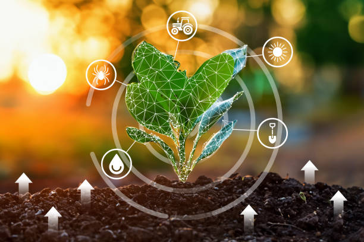

# 🌱 Smart Plant Monitoring and Watering System

  

## 📚 Table of Contents
- [Overview](#-overview)
- [Description](#-description)
- [Project Structure](#-project-structure)
- [Devices](#%EF%B8%8F-devices)
- [Implementation](#%EF%B8%8F-implementation)
- [Diagram](#-diagram)

## 📌 Overview
This is the final project for the Embedded Systems course.
The system monitors environmental parameters for crops and supports automated watering.

## 📖 Description
The system consists of sensors that measure environmental conditions such as temperature 🌡️, humidity 💧, light intensity ☀️, and soil moisture 🌱.
- Data is collected by an Arduino Uno (ATmega328P) running bare-metal C code (no Arduino libraries).
- The Arduino sends the data to a Raspberry Pi 3B+, which acts as the central processing server.
- The Raspberry Pi publishes the data via MQTT protocol to a laptop (host) for real-time display and monitoring.
- The Arduino can control a DC water pump motor for automated watering when soil moisture is low.

## 📁 Project Structure
~~~
Plant-water/
├── BareMetal_Peripherals/             # Code Bare-metal C for ATmega328p
│   ├── *.h
│   └── *.c
├── Doc/                               # Datasheet for sensor and MQTT
├── Driver/                            # Library for communicating with DHT22 and BH1750 sensors.
│   ├── BH1750_Lib
│   └── DHT22_Lib                       
├── Images/                            # Schematic and interface illustrations
├── Src/
│   ├── Arduino_To_Rasp.c              # Run on Arduino
│   ├── MQTT_DATABASE.c                # Run on Laptop
│   └── Ras_To_MQTT.c                  # Run on Rasp Pi 3B+
├── WEB/                               # Web dashboard for viewing sensor data on laptop
├── LICENSE
└── README.md
~~~

## 🛠️ Devices
### 1. Hardware

| STT     |        Name           | Price   |
| :-----: | :-------------------- | :------:|
|    1    | Raspberrby 3B+        |    💰   | 
|    2    | Arduino Uno           |    💰   | 
|    3    | DHT22                 |    💰   |  
|    4    | BH1750                |    💰   |   
|    5    | Soil moisture         |    💰   | 
|    6    | DC water pump motor   |    💰   | 
|    7    | Module Relay 5V       |    💰   |  

### 2. Driver Lib
| Device Name           | Library Completed  | Check   |  API     |
| :-------------------- | :----------------: | :-----: | :-----:  |
| Bare-metal ATmega328p |       ✔️          | ✔️      |  [Detail](https://github.com/Nguyen-Dang-Trieu/Plant-water/blob/main/Doc/ATmega328p_API.md) |
| DHT22                 |       ✔️          | ✔️      |  [Detail](https://github.com/Nguyen-Dang-Trieu/Plant-water/blob/main/Doc/DHT22_API.md)      |
| BH1750                |       ✔️          | ✔️      |  [Detail](https://github.com/Nguyen-Dang-Trieu/Plant-water/blob/main/Doc/BH1750_API.md)     |   

## 🚀 Getting Started
Follow these steps to set up and run the project:

1. **Clone the Repository:**  
   Clone this repository to your local machine using:
   ~~~bash
   https://github.com/Nguyen-Dang-Trieu/Plant-water.git
   ~~~
2. **Install dependent libraries**
3. **Run the appropriate files for the hardware according to the directory**

## ⚙️ Implementation
- ✔️ The Arduino Uno is programmed in bare-metal C, directly accessing hardware registers for GPIO, ADC, and I2C communication.
- ✔️ The Raspberry Pi 3B+ runs an MQTT broker (HiveMQ) and C client to process and forward data.
- ✔️ The laptop subscribes to MQTT topics to receive and display the data.

##  🍃 Diagram
### 1. System

### 2. Monitor screen

## 📈 Development
- Add module nrf24L01 to be able to communicate wirelessly
- Write bootloader to update firmware throught nrf24l01.
- Redesign the web interface (Blynk IoT Platform), Node-Read
- Tìm hiểu về GDD, 
- EEPROM: ic2431
- Dùng arduino mega 2560 + external RAM
