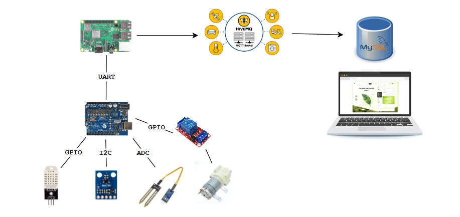

# 🌱 Smart Plant Monitoring and Watering System
## 📚 Table of Contents
- [Introduction](#-introduction)
- [Project Description](#-project-description)
- [Project Structure](#-project-structure)
- [Devices](#%EF%B8%8F-devices)
- [Implementation](#%EF%B8%8F-implementation)
- [Diagram](#-diagram)

## 📌 Introduction
This is the final project for the Embedded Systems course.
The system monitors environmental parameters for crops and supports automated watering.

## 📖 Description
The system consists of sensors that measure environmental conditions such as temperature, humidity, light intensity, and soil moisture.
- Data is collected by an Arduino Uno (ATmega328P) running bare-metal C code (no Arduino libraries).
- The Arduino sends the data to a Raspberry Pi 3B+, which acts as the central processing server.
- The Raspberry Pi publishes the data via MQTT protocol to a laptop (host) for real-time display and monitoring.
- The Arduino can control a DC water pump motor for automated watering when soil moisture is low.

## 📁 Project Structure
~~~
Plant-water/
├── BareMetal_Peripherals/             # Code Bare-metal C for ATmega328p
│   ├── *.h
│   └── *.c
├── Doc/                               # Datasheet for sensor and MQTT
├── Driver/                            # Library for communicating with DHT22 and BH1750 sensors.
│   ├── BH1750_Lib
│   └── DHT22_Lib                       
├── Images/                            # Schematic and interface illustrations
│   ├── system_.png
│   └── web.png
├── Src/
│   ├── Arduino_To_Rasp.c              # Run on Arduino
│   ├── MQTT_DATABASE.c                # Run on Laptop
│   └── Ras_To_MQTT.c                  # Run on Rasp Pi 3B+
├── WEB/                               # Web dashboard for viewing sensor data on laptop
├── LICENSE
└── README.md
~~~

## 🛠️ Devices
- Raspberry Pi 3B+ (MQTT broker & data processing)
- Arduino Uno (ATmega328P) (bare-metal C code for sensor reading & control)
- Sensors:
  - DHT22 (temperature & humidity)
  - BH1750 (light intensity)
  - Soil moisture sensor
- DC water pump motor
- Module Relay 5V

## ⚙️ Implementation
- ✔️ The Arduino Uno is programmed in bare-metal C, directly accessing hardware registers for GPIO, ADC, and I2C communication.
- ✔️ The Raspberry Pi 3B+ runs an MQTT broker (HiveMQ) and C client to process and forward data.
- ✔️ The laptop subscribes to MQTT topics to receive and display the data.

##  🍃 Diagram
### System

### Monitor screen

### 📈 Development
- Add module nrf24L01 to be able to communicate wirelessly
- Write bootloader to update firmware throught nrf24l01.
- Redesign the web interface (Blynk IoT Platform)
- ic flash W25Q64, https://www.youtube.com/watch?v=GvqfkNLJmu0
- Tìm hiểu về GDD, 
